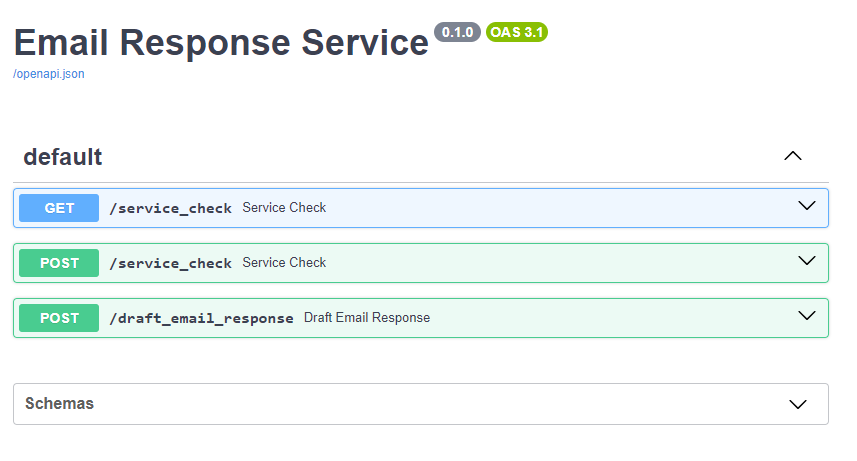

#  Automatic answer emails using pre-collected Business Knowledge (keeping Human-in-loop)

Many organisations/individuals have piles of documents containing valuable information but are little used after their initial creation.

*RAG* (Retrieval Augmented Generation) AI techniques allow you and colleagues to have conversations with these documents - allowing you to combine the accuracy of the documents and the "chattiness" of AIs like ChatGPT. 

This project is code to implement a pilot RAG Chatbot in a not for profit VC. Given the community nature of the organisation (and the out-of-hours development) it is shared for reuse. It focuses on answering internal corporate queries (i.e. managing sensitive data, but also leveraging on a human-in-the-loop to both filter answers and provide feedback to learn).

It is our experience that 90% of business and public sector knowledge sharing environments will have similar requirements; this code is being shared as a starter pack to share best practice.

### What can you do with this project? 

The video presentation gives background, and demo of one of parts of the project in action:

| **AI and Product Management- Bio an Intro**  | **Product Demo**  | 
|---|---|
|  |   |

Other key features:

1. **Ingest Key Business Information** - load information (e.g. pdf or email) into the KnowledgeBase (Elastic)
1. **Answer Key Business Questions** - Friendly User Interface to answer questions in a back and forward way, focussing on 4 key business use cases e.g. automatically answering Outlook emails
1. **Automatically Answer questions as part of a flow**. These Bots are Designed to be used as part of Power Automate or other automatic workflow.

### Keeping confidential information confidential by default

For obvious reasons only generic code and no information / knowledge is shared in this GitHub project. This has the benefit of you being able to add only your own documents when you run your secure local copy. Other key project features with confidentiality in mind:

* Information is stored locally by default in Elastic Search
* LLM (Lllama) runs locally (with options to use other remote LLMs)
* Confidential information redacted before sending to LLM (see setting in config file is you wish to turn this off)

To further limit exposure, we recommend care in ingesting *only* emails and documents that have already been sent externally. Since the project is open source, you can fully audit the code before use.

## Key sections in this guide 
* [Project Configuration](#Config)
* [First Time Setup](#First-Time-Setup)
* [Starting the background layers](#Starting-the-background-layers)
* [Ingesting key knowledge into the system](#Running-the-Ingest-Script)
* [Asking / Answering key questions using the Web App, Email response, and Bot](#Running-the-Application-and-Bot)

### Underlying technologies:
* Choice of Large Language Model (LLM) - either local such as LLAMA or remote (e.g. Microsoft Copilot, OpenAI or Gemini from Google).
* Elastic Search as the Vector search engine. 
* Docker file gives "Human Friendly" UI (Kibana) for colleagues to fine-tune the Elastic search results.
* Langchain to integrate the above steps. Langchain also allows for further extensions such as a choice of more LLMs, more document indexing, varying of steps in the response chain depending on the question asked.
* Built using Python scripts allowing for easy modificiation.
* Streamlit for a user friendly User Interface.
* Optional
  * Read / Writes files to Excel 365 - allows for integration with wider Office 365 and Power Automate workflows.
  * Outlook extension to auto-draft emails.

## Configuration
* The main confirmation file is  in `app/config/config.conf` . This config file is shared for the ingest script, the Bot and the Application. Please edit this using the notes in the `app/config` folder.
* Some APIs (Copilot, OpenAI, Teamworks helpdesk) require tokens the first time they are run. Please consult the documentation of these tools to retrieve these. 
* The script will ask you for these tokens and store them locally. This is a plain text json file(`token-storage-local.json`). While it is excluded from storage in git, you may wish to review who has access to it locally as it will store sensitive information.

## First time Setup

To setup the project on your local machine, then run for the first time:
1. Checkout / download the project as a folder onto the host computer from the source https://github.com/paulbrowne-irl/knowledgebase-elastic-rag

1. Install Python (3.12 or higher) in the usual way. Python `pip` and `virtualenv` tools are also needed.

1. Install Python dependencies - in a terminal window, at the project root
    * Create virtual environment: `virtualenv venv`
    * Activate virtual environment: `source venv/bin/activate`
    * Install Python dependencies for this environment: `pip install -r requirements.txt`

1.  Install Python dependencies - Client Only (Optional) 
    * The project is split into a REST Server, and a minimal client (e.g. for creating outlook emails locally using Win32 calls on Windows)
    * It is sometimes easier to install *only* the minimum Python Dependencies on windows
    * In this case, follow the above instructions on the Windows machine, usng the `requirements-client.txt` file instead. 
    * The specifc commans to install the Python Virtual Environment will differ slightly on windows.

1. Install Docker - standard install (either Docker Desktop, or via WSL-Ubuntu) from https://docs.docker.com/engine/install/ubuntu/
    * You will also need to install the docker-compose plugin
    * For most systems this is `sudo apt install docker.io` , then install docker compose `sudo apt-get install docker-compose-plugin`

1. Setting up the Local LLM - if needed
    * The config file gives the option of passing questions a *private* local LLM using Ollama (e.g. Llama 3.2 from Meta). The Docker file can help you run this local LLM.
        * Check the `docker-compose.yml` file so that the "Ollama" and "OpenWebUI" are not commented out.
        * OpenWebUI is optional , but provides a useful web interface on http://localhost:3000
    * Start Docker as normal using `docker compose up`		
    * Ollama provides the infastructure - you will need to tell it (first time) which LLM to use.
        * Open a new console / terminal
        * Pull the relevant llm `docker exec -it ollama ollama run llama3.2`

1. Setup index in Elastic (first time only):
    * Start Elastic using `docker compose up` from the root folder of the project.
    * Open Kibana to manage the Elastic Index - http://localhost:5601/app/management/data/index_management/indices
    * Setup indices 
        * `test-can-del` - used by unit tests
        * `knowledge_base` - the main index used to store documents

It is possible to install Elastic and Kibana directly on the machine (i.e. no Docker needed). Please refer to the Elastic / Kibana project docs page for instructions.

# Running the application

## Starting the background layers

A Docker compose file is provided to make it easy to download and run the supporting infrastructure (e.g. the Elastic Search engine). To start this Infrastructure using Docker:
* Open a (new) terminal window, navigate to home folder containing `docker-compose.yml`
* Start Elastic and Kibana and other services using: `docker compose up`

You can check if the Elastic Search Service is running using the url http://localhost:9200/. You should see a success message similar to the screenshot below.

The Kibana App runs on top of Elastic and allows you to create indexs to store and search data. It is also useful in fine-tuning the searches so that we can pass more relevant documents as a prompt to the large language model. Kibana (Elastic Search Management tool) available on http://localhost:5601

No screenshot, but also automatically started is the Portainer Web Management for Docker, available at https://localhost:9443 . This is useful for managing all the Docker containers, but can safely be commented out in the docker-compose file if this is not needed.

## Running the Application

The application is a UI, easier to use. Bots are semi-automatic and does many of the same things, but as part of a process flow. Both rely on the REST API exposed by the service.

### Running the Service 
The scripts provide a simple service to expose a Rest API. To start the server (`service_email.py`)from the app folder:
* `uvicorn service.service_email:app --reload`
* Open a web browser to view the REST api on http://localhost:8001/docs . In some configurations this may run on port 8000 instead,

Note that some other examples (some bots) depend on this server - but should remind you to start it if needed (either a friendly reminder, or an error message that it cannot connect to server)

### Running the Ingest Script 

Before using a Knowledgebase you obviously need to import knowledge into it. 
* The main script to ingest data is in the `app/ingest.py` . 
* This script will take a starting folder (as set in `config.conf`)and index most of the files (pdf, messages , word docs) found in that folder. It will also find sub-folders and index those recursivly.

To run the ingest script
* Open the app folder: `cd app` in a terminal window
* Activate the Python environment with dependencies you installed earelier: `source venv/bin/activate`
* Run the script using `python ingest.py`
    * (You may need to be more version specific e.g. python3 ingest.py)

In general, you will only need the ingest script once (or infrequently, if you wise to add more documents). For small datasets, it is probably easier to delete the Knowledgebase index (using Kibana - see link and screenshot above), then run the Ingest script again.

### Running the Web Application / Windows client to answer Outlook emails
* open windows client - streamlit run app.py (from app folder on windows)

The Web application addresses a wider range of business use cases than the bot - see the tabs on the left hand side of the screenshot below.

To run the Web Application.
* Open the app folder: `cd app` in a terminal window
* Activate the Python environment with dependencies you installed earelier: `source venv/bin/activate`
* Run Streamlit app to interact with documents local llm: `streamlit run app.py`
* App available on http://localhost:8501 

### Running the Bot - Excel

Typical flow for the Bot is to read a question from Excel, apply RAG techniques to answer the question, then save the answer back in Excel. Since the Excel file can be hosted online, this allows Integration with Office 365 and Power Automate. e.g.
1. The User can ask a question on Microsoft Forms
1. Power Automate saves this question in Excel.
1. The Bot reads the question, saves the answer back in Excel.
1. Human can review the answer, update the line in Excel if they are happy with it.
1. Power Automate can send back the answer to the original person using email.

To run the bot.
* Open the app folder: `cd app` in a terminal window
* Activate the Python environment with dependencies you installed earelier: `source venv/bin/activate`
* Run the script using `python bot_excel.py`

